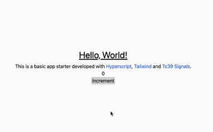

# Hyper Tailwind TC39 Signals

I wanted to play around with the [TC39 Signals proposal](https://github.com/tc39/proposal-signals) but didn't want to use Solid which already has signals. So I threw together this "framework".
- Typescript
- Hyperscript allows more convenient element creation when compared to `document.createElement`
- Tailwind for quick styling and colocation of style and markup
- And of course the Signals polyfil & the Effect example implementation
- (Vite for Tailwind and Typescript)

Feel free to clone, fork or use as template repository.

<!-- Feel free to delete this .github folder -->